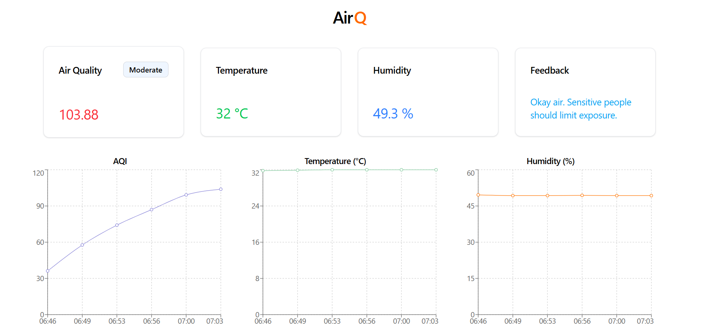
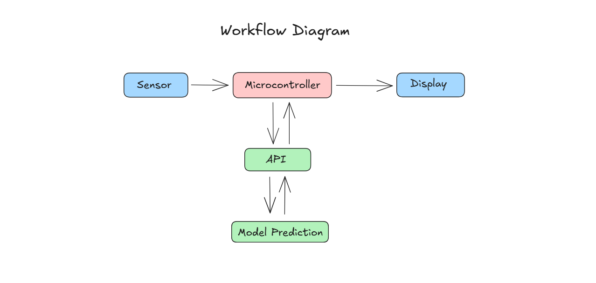

# AirQ

AirQ is an IoT-based air quality measurement and feedback system that monitors environmental conditions and provides intelligent insights using machine learning.

### Tech Stack

- **Sensors**: MQ135, DHT22
- **Microcontroller**: ESP32
- **IDE**: Arduino IDE
- **Backend**: FastAPI
- **ML Model**: Random Forest
- **Languages**: C++ (ESP32), Python (Backend)

### Flow Diagram

